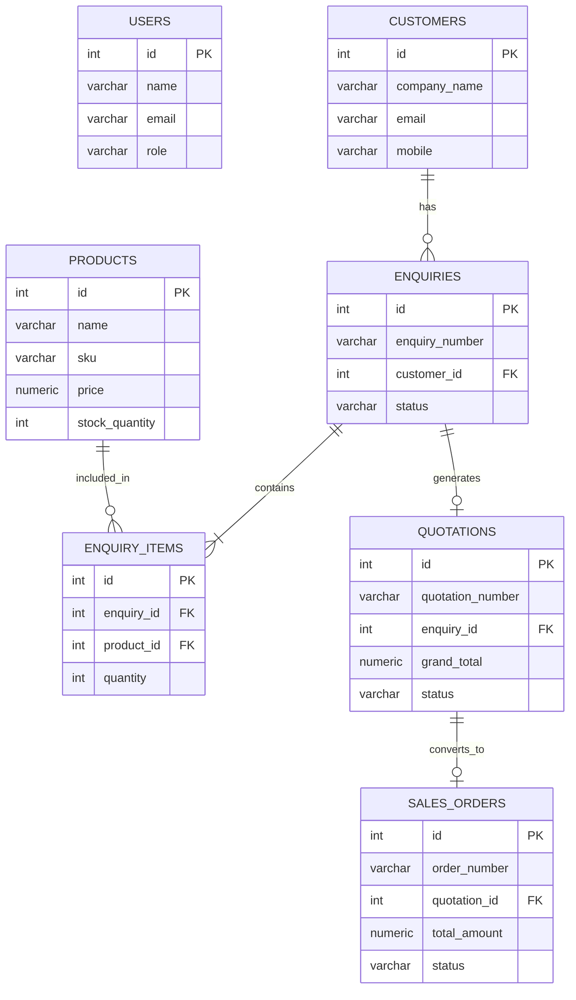

# B2B ERP System: Enquiry-to-Dispatch

A full-stack Enterprise Resource Planning (ERP) case study demonstrating a complete B2B workflow from customer enquiry to final product dispatch. It features role-based access control, transaction safety, and complex database concurrency management.

## Tech Stack
* **Frontend:** React.js, Vite
* **Backend:** Node.js, Express.js
* **Database:** PostgreSQL (pg)
* **Concurrency Control:** PostgreSQL `FOR UPDATE` row-level locks

## Project Setup

### Prerequisites
* Node.js (v16+)
* PostgreSQL (v12+)

### 1. Database Setup
1. Create a PostgreSQL database named `erp_db`.
2. Ensure you have a user with privileges to create tables.

### 2. Environment Variables
Create a `.env` file in the `/backend` directory with the following variables:

```env
PORT=5000
DB_USER=postgres
DB_PASSWORD=pg_4321
DB_HOST=localhost
DB_PORT=5432
DB_NAME=erp_db
JWT_SECRET=super_secret_erp_key_123
```

### 3. Migration / Seed Instructions
1. Navigate to the backend directory: `cd backend`
2. Run the initialization script or execute your SQL schema file directly in pgAdmin to seed initial products and users.

### 4. How to Run the Application

**Run the Backend:**
```bash
cd backend
npm install
npm run dev
```

**Run the Frontend:**
```bash
cd frontend
npm install
npm run dev
```

### Test Login Credentials
* **Admin / Manager:** `admin@erp.com` | Password: `password123`
* **Sales User:** `sales@erp.com` | Password: `password123`

### Key Workflow (Enquiry-to-Dispatch)
1. **Login:** Authenticate via JWT.
2. **Enquiry:** Log customer requirements. Auto-seeds missing customers/products to prevent FK constraints.
3. **Quotation:** Generate and accept a quotation based on an enquiry.
4. **Sales Order:** Convert accepted quotation to a sales order.
5. **Reservation:** Confirm order to reserve physical stock using database transactions (`BEGIN`/`COMMIT`).
6. **Dispatch:** Dispatch order to deduct inventory permanently.

## Database Schema (ER Diagram)


